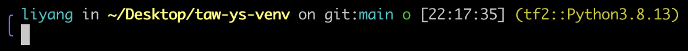

## taw-ys-venv

Zsh theme which improved based on [taw-ys-zsh](https://github.com/AzarAI-TOP/taw-ys-zsh-theme)

Its look like


### Usage

``` python
# clone repo
git clone git@github.com:BrokeDudeAbula/taw-ys-venv.git

# cp theme file into omz themes folder
cp path/to/taw-ys-venv/taw-ys-venv.zsh-theme path/to/.oh-my-zsh/themes/

# set ZSH_THEME into taw-ys-venv
vim path/to/.zshrc
ZSH_THEME="taw-ys-venv"

```

